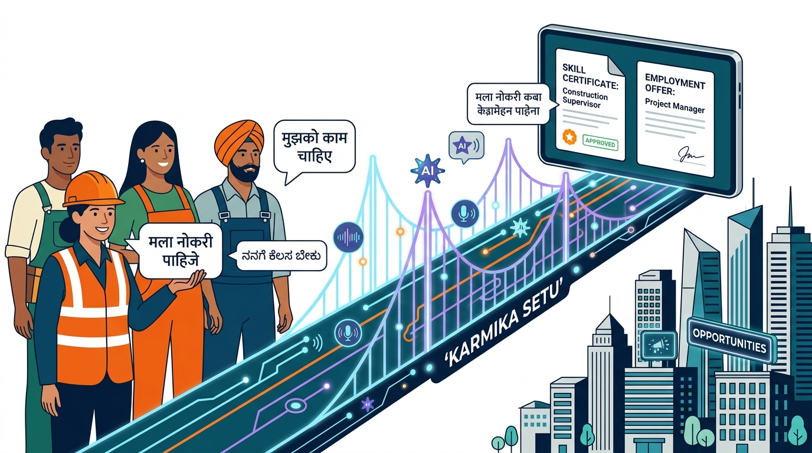

# 🧱 Karmika Setu (कर्मिका सेतु) — The Trusted Bridge for India's Blue-Collar Workforce

<p align="center">
  
</p>

Karmika Setu is an inclusive, AI-first platform designed to empower and dignify India's informal, blue-collar workers (Karmikas) by building a verified digital identity, translating unstructured daily logs into verifiable resumes, and unlocking pre-approved formal financial services.

---

## 📌 Problem Statement

The informal labor ecosystem in India comprises over **400 million workers** (construction workers, domestic helpers, carpenters, plumbers, agricultural laborers) who form the backbone of the economy. However, they face systemic challenges:

1. **Invisible Work History**: Because their transactions are cash-based and informal, workers have no paper trail, reference letters, or verifiable work records. This keeps them invisible to the formal economy.
2. **Exclusion from Banking**: Without verifiable income or employment histories, workers are barred from formal banking, leaving them dependent on predatory local moneylenders charging up to 10% interest monthly.
3. **The Literacy and Language Barrier**: Traditional applications require structured form-filling in English. For individuals with low digital literacy or high illiteracy rates, complex typing and navigation become insurmountable barriers.
4. **Sourcing Inefficiencies**: Contractors and developers struggle to find verified, skilled labor, relying on fragmented sub-contractor chains that result in delays and high fees.

---

## 🚀 The Solution: Karmika Setu

**Karmika Setu** acts as a trusted, multi-lingual digital ledger and bridge, connecting workers directly with verified employers, credit agencies, and banking partners.

### 🎙️ Breakthrough: AI-Voice Scribe for Low-Literacy Workers
To dismantle the digital literacy barrier, Karmika Setu integrates a **voice-first, multi-lingual logging engine** powered by **Gemini AI**:
- **Natural Audio Input**: A worker simply presses a microphone button and speaks naturally in their native regional tongue (e.g., *"आज मैंने डीएलएफ साइट पर ५ घंटे प्लास्टर का काम किया और ३०० रुपये मजदूरी मिली"*).
- **Intelligent Extraction & Translation**: The system captures the audio, transcribes it, and routes it to a server-side Gemini prompt.
- **Structured English Database Records**: Regardless of the input dialect, Gemini extracts and parses the data into structured, clean database parameters in English:
  - **Work Type**: Plastering / Masonry
  - **Hours Logged**: 5 Hours
  - **Compensation**: ₹300
  - **Location**: DLF Construction Site
  - **Status**: Pending Verification
- **Empowerment through Simplicity**: Workers never have to type or navigate complex structures. Their voice is their pen.

---

## 🛠️ Complete Workflow & Features

Karmika Setu is designed as a balanced multi-user ecosystem serving two main user personas: **Karmikas (Workers)** and **Principals/Contractors/Organizations**.

```
[ Worker speaks log in regional tongue ]
                 │
                 ▼
[ Gemini AI structures & translates to English ]
                 │
                 ▼
[ Saved to Database & Sent to Employer for Sign-off ]
                 │
                 ▼
[ Trust Score updated based on verified work ] ────► [ Unlocks Micro-loans & Insurance ]
```

### 1. For Workers (Karmikas)
* **Karmika Digital ID Card**: A clean, printable PDF identification card containing a unique ID (`Setu ID`) and dynamic QR code linking to their verified public profile.
* **Smart Skills Certificate**: A professional, downloadable work certificate verifying cumulative work days, top rated skills, and aggregate peer feedback.
* **Voice Log Ledger**: An interactive dashboard showing earnings, verified hours, and live verification status.
* **Financial Hub**: Low-interest micro-loans (capped at 1.5% monthly) and affordable insurance packages directly linked to the worker’s compiled **Karmika Setu Trust Score**.

### 2. For Organizations & Contractors
* **Live Workforce Dashboard**: High-level telemetry displaying active job postings, hired worker counts, pending applications, and real-time verification stats.
* **Worker Search & Sourcing**: Filter verified talent pools by location, specific skills (masonry, electrical, helper), rating, and language proficiency.
* **Instant Verification Terminal**: Approve or decline worker log requests in one tap. This turns unverified daily logs into certified work credentials.
* **Impact & Analytics**: Track corporate social responsibility (CSR) statistics, workforce density, and wage distribution metrics.

---

## 💻 Running the App Locally

If you want to clone this repository and run the application on your local development machine, follow these steps:

### 1. Prerequisites
Make sure you have [Node.js](https://nodejs.org/) (v18 or higher) and `npm` installed on your machine.

### 2. Clone the Repository
```bash
git clone <your-repository-url>
cd karmika-setu
```

### 3. Install Dependencies
```bash
npm install
```

### 4. Configure Environment Variables
Create a `.env` file in the root directory (based on `.env.example`):
```env
# Firebase Configuration (Get these from your Firebase Console)
VITE_FIREBASE_API_KEY=your_api_key_here
VITE_FIREBASE_AUTH_DOMAIN=your_auth_domain_here
VITE_FIREBASE_PROJECT_ID=your_project_id_here
VITE_FIREBASE_STORAGE_BUCKET=your_storage_bucket_here
VITE_FIREBASE_MESSAGING_SENDER_ID=your_messaging_sender_id_here
VITE_FIREBASE_APP_ID=your_app_id_here

# Server-side Secret (Only if running the full-stack server)
GEMINI_API_KEY=your_gemini_api_key_here
```

### 5. Launch the Development Server
```bash
npm run dev
```
Open your browser and navigate to `http://localhost:3000` (or the port specified in your terminal output) to access the application.

---

## 🌐 Publishing to Netlify

Since this is a high-performance Single Page Application (SPA) built using React, Vite, and Tailwind CSS, it can be deployed directly to Netlify for free.

### Step 1: Push Your Code to GitHub
Push your local code to your public or private GitHub repository using the native integration on this workspace or your local git terminal:
```bash
git init
git add .
git commit -m "feat: initial commit of Karmika Setu"
git remote add origin <your-github-repo-url>
git branch -M main
git push -u origin main
```

### Step 2: Deploy on Netlify
1. Log in to your [Netlify Dashboard](https://app.netlify.com/).
2. Click **Add new site** > **Import an existing project**.
3. Select **GitHub** and authorize Netlify to access your repository.
4. Select your `karmika-setu` repository.
5. Configure the **Build settings**:
   - **Base directory**: Leave blank (or root `/`)
   - **Build command**: `npm run build`
   - **Publish directory**: `dist`
6. Click **Deploy site**.

### Step 3: Configure SPA Routing (Crucial for Page Refresh)
Vite SPAs use client-side routing. If you refresh a page on Netlify, you might get a `404 Not Found` error. 
To prevent this, we have configured standard SPA fallback rules. On Netlify, this can be resolved by ensuring a `_redirects` file exists in your publish directory. 

You can create a file named `_redirects` under your `public/` folder with the following content:
```text
/*    /index.html   200
```
*(Any file placed in the `public/` folder will be copied directly to the `dist/` folder during the build process, satisfying Netlify's routing rules).*

### Step 4: Configure Environment Variables in Netlify
To make sure Firebase works correctly on your deployed app, you must add your Firebase configuration variables to Netlify:
1. Go to your site dashboard on Netlify.
2. Navigate to **Site configuration** > **Environment variables**.
3. Add all your `VITE_FIREBASE_*` variables here matching the values in your `.env` file.
4. Trigger a new deploy to apply the changes.

---

## 🔑 Troubleshooting: Firebase `operation-not-allowed` Error

If you attempt to log in or register and receive the following error:
> **Authentication failed: Firebase: Error (auth/operation-not-allowed). Please check your connection.**

### Why does this happen?
This error means that you have successfully connected your app to Firebase, but you have not enabled the **Email/Password** sign-in provider in your Firebase project console.

### How to fix it:
1. Go to the [Firebase Console](https://console.firebase.google.com/).
2. Select your project.
3. In the left-hand navigation sidebar, click on **Build** > **Authentication**.
4. Click on the **Sign-in method** tab at the top.
5. Under **Sign-in providers**, click **Add new provider**.
6. Select **Email/Password** from the list.
7. Click the **Enable** switch (you do not need to enable Email link / passwordless unless you want to) and click **Save**.
8. Go back to your application and try signing in or registering again — the error will be resolved!

---

## 🎨 Design and Visual Theme

Karmika Setu is styled with a highly professional, high-contrast, human-centric aesthetic:
* **The "Karmic Slate" Palette**: Deep slate charcoal as base inks, off-white canvases for clean structural contrast, and warm saffron/brandy accents symbolising energy and labor dignity.
* **Modern Typography**: Pairings of **Inter** for clean, legible numeric logs and user interfaces, with **Space Grotesk** headings for premium digital presentation.
* **Responsive Layouts**: Fully mobile-first design targeting responsive grids on phones (used by workers on site) and comprehensive analytics views on desktop (used by contractors).
