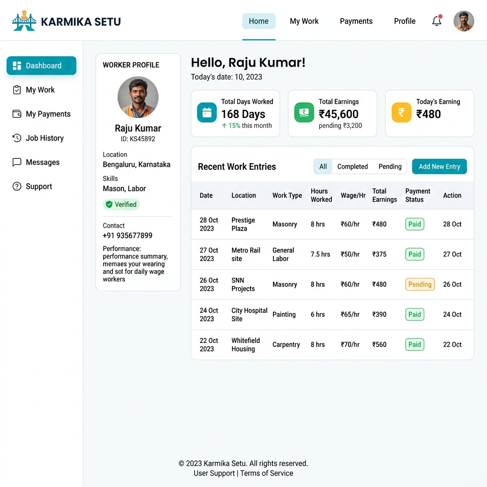
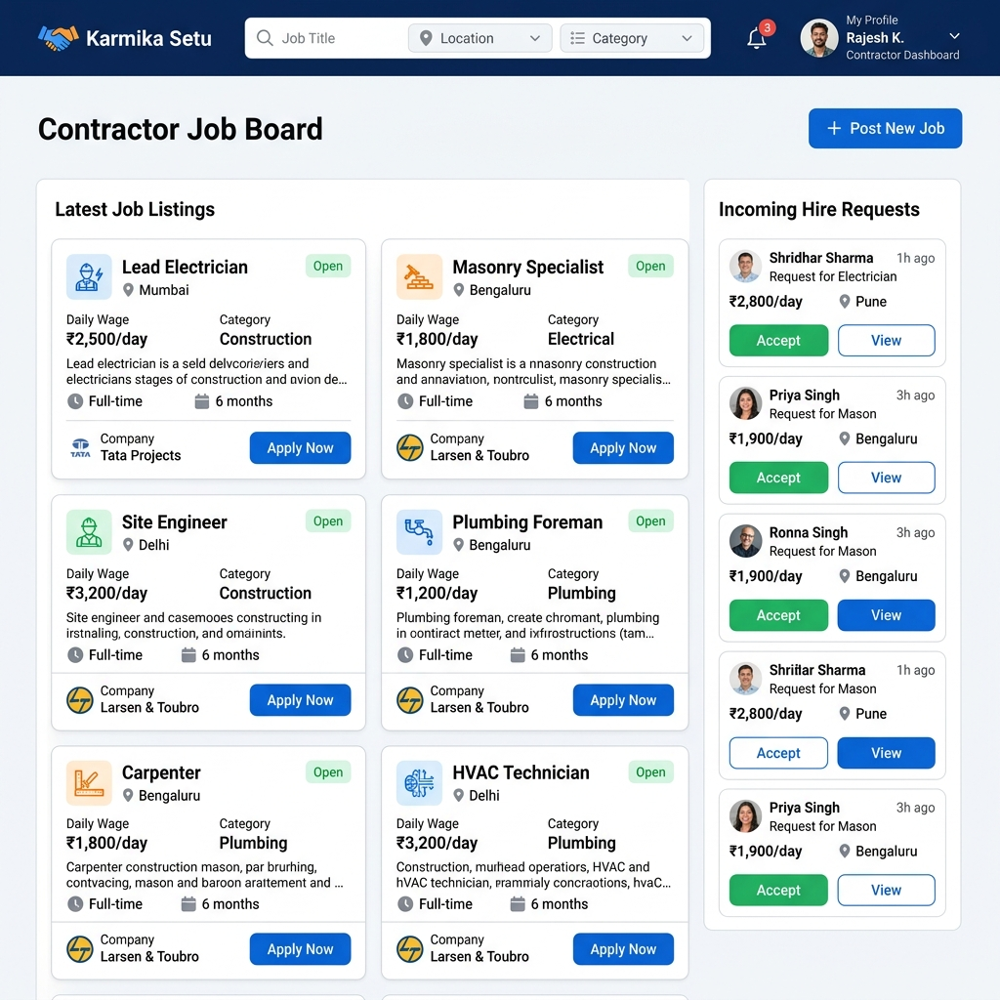

<div align="center">
  <h1>Karmika Setu 🌉</h1>
  <p><em>Empowering Daily Wage Workers and Contractors</em></p>
</div>

## 📖 About the Project
**Karmika Setu** (Worker's Bridge) is a modern web platform designed to bridge the gap between daily wage laborers and contractors. The application provides a transparent, efficient, and verifiable system for tracking work history, managing payments, and finding new job opportunities.

By digitizing the daily wage ecosystem, Karmika Setu ensures workers have a verifiable work record (acting as a digital resume) and contractors have a reliable pool of verified talent.

## 📸 Platform Sneak Peek

### Worker Dashboard
Workers can track their total earnings, days worked, and recent work history.


### Contractor Job Board
Contractors can post new opportunities, manage job listings, and review incoming hire requests.


## 🔄 How It Works (Workflow)

The platform supports two primary user roles with distinct workflows:

### For Workers (Laborers)
1. **Profile Setup**: Register and complete a profile with skills, preferred language, and identity details.
2. **Log Work**: At the end of a shift, workers log their hours and payment status (Pending/Paid).
3. **Verification**: The logged entry is sent to the respective contractor for verification.
4. **Find Jobs**: Browse active job listings posted by contractors and apply or accept direct hire requests.

### For Contractors & Organizations
1. **Verification**: Review and approve work entries submitted by workers to build trust in the ecosystem.
2. **Job Listings**: Post new work requirements (e.g., Construction, Plumbing) with daily wage details and location.
3. **Hire Talent**: Browse verified worker profiles and send direct hire requests.

## ✨ Features

- **Role-Based Authentication**: Secure login tailored for Workers, Contractors, and Organizations.
- **Work Logging & Tracking**: Maintain an immutable history of days worked, hours, and earnings.
- **Job Marketplace**: A centralized board for posting and finding daily wage work.
- **Verification System**: A two-way handshake where workers log work and contractors verify it.
- **Multilingual Support**: Preferences for English, Kannada, Tamil, Hindi, etc., ensuring accessibility.
- **Real-time Sync**: Powered by Firebase Firestore for real-time updates and secure data management.

## 🚀 Getting Started Locally

To run the Karmika Setu application on your local machine:

**Prerequisites:**  Node.js (v18+)

1. **Install dependencies:**
   ```bash
   npm install
   ```
2. **Configure Environment:**
   Create a `.env` file in the root directory and add your Firebase configurations.
3. **Run the development server:**
   ```bash
   npm run dev
   ```
4. Open [http://localhost:3000](http://localhost:3000) in your browser.
